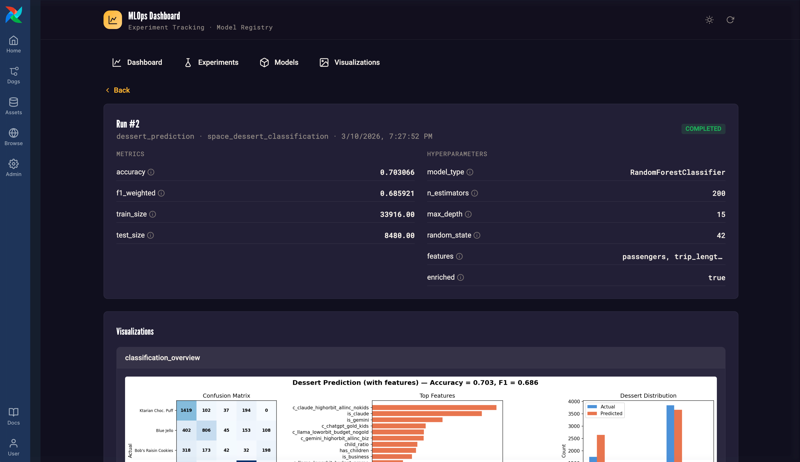

# Apache Airflow® and MLOps Workshop - 101

Welcome to the Apache Airflow and MLOps Workshop (101)! You will build an example pipeline for all three fundamental ML paradigms: classification, regression, and clustering, all orchestrated by Airflow and track the experiments in the MLOps Airflow plugin.

What you will learn:
- Using Airflow to orchestrate feature engineering.
- Asset-based scheduling to trigger Dag runs based on successful completion of previous tasks.
- Dynamic task mapping to train multiple models with different sets of hyperparameters.
- Using an Airflow plugin to track ML experiments.

> [!NOTE]
> tl;dr: jump directly to the [exercises](exercises.md).

## Prerequisites

- Access to the [Astro IDE](https://www.astronomer.io/product/ide/).

## Scenario: AstroTrips Catering Predictions

AstroTrips is a fictional travel company specializing in interplanetary trips. Customers can book journeys to destinations like Mars, Venus, or Saturn, complete with launch windows, spacecraft assignments, and premium add-ons.


The underlying database used for AstroTrips is DuckDB, and it comes with a set of base tables and might be extended with additional tables depending on the workshop.


The MLOps workshop centers around predicting culinary customer behavior, particularly their choice of dessert and total spending during their trip. The [MLOps plugin](plugins/airflow-mlops-plugin) tracks all the ML experiments directly in the Airflow UI.



## Using MotherDuck (optional)

> [!CAUTION]
> This optional step can be skipped for regular workshop participation. It is intended for advanced exploration after the workshop.

This project is configured to use DuckDB with a local database file stored in `include/astrotrips.duckdb`. While this setup is sufficient for this scenario, it has specific limitations:

- **No concurrent access:** The database cannot be written to by multiple concurrent processes.
- **No distributed processing:** Because the database is a local file, all Airflow tasks must run on the same node to access it. This works reliably with the Astro CLI local environment (which uses the `LocalExecutor` to spawn worker subprocesses within the scheduler container) or a single-worker setup. However, it will fail in a distributed environment with multiple distinct worker nodes.

To run this code in a distributed setup or enable concurrent access, you can easily switch to [MotherDuck](https://motherduck.com), a managed cloud service for DuckDB.

1. Sign up for a free account at [motherduck.com](https://motherduck.com).
2. Once logged in, create a new attached database named `astrotrips`.
3. Go to **Settings** -> **Integrations** -> **Access Tokens**.
4. Click **Create token**, keep the default settings, and select **Create token** in the popup window.
5. Copy the generated token and update the connection details in your `.env` file as follows:

```
AIRFLOW_CONN_DUCKDB_ASTROTRIPS='{
    "conn_type":"duckdb",
    "host":"md:astrotrips?motherduck_token=<YOUR_MOTHERDUCK_TOKEN>"
}'
```

> **Note:** Ensure you also update any other references to the local DuckDB file path, such as `include/connections.yaml` if applicable.

## Using Astro CLI (optional)

> [!CAUTION]
> This optional step can be skipped for regular workshop participation. It is intended for advanced exploration after the workshop.

This workshop can also be worked on using the Astro CLI and a local, containerized Airflow setup. Copy `.env.dist` to `.env`, then adjust the configuration values if needed. You can start the project with `astro dev start`. However, the workshop is primarily designed for use with the Astro IDE.

## Get started 

Please proceed by following the exercises in [exercises.md](exercises.md).