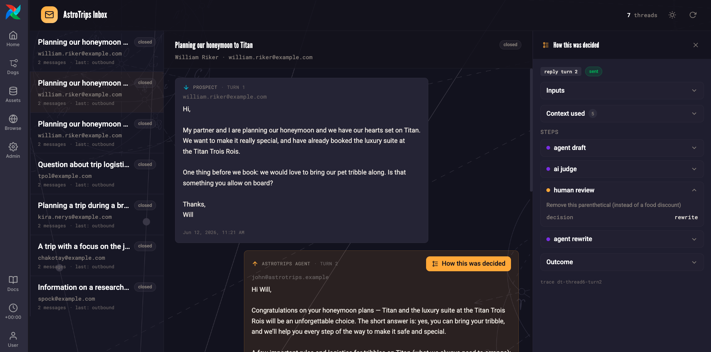

# Apache Airflow® MLOps and AI workshop

Welcome to the [Apache Airflow®](https://airflow.apache.org/) for MLOps and AIOps Workshop! 

This workshop shows advanced patterns of how to use Airflow to orchestrate AI and MLOps actions together.

You will learn how to:
- track ML experiments, runs, models, and visualizations directly in the Airflow UI with the MLOps plugin.
- engineer features and train a regression model across a hyperparameter sweep to predict per-person, per-day catering spend.
- improve that model by having an AI agent extract extra features from unstructured prospect emails.
- (bonus) run the trained model in batch to forecast catering revenue across upcoming trips.
- (bonus) build a sales-email agent and improve it with context engineering (RAG), a context layer, the ML model as a Dag-as-a-tool, and a decision-trace self-improvement loop.

> [!NOTE]
> tl;dr: jump directly to the [exercises](exercises.md).

## Prerequisites

- Access to the [Astro IDE](https://www.astronomer.io/product/ide/) or having the [Astro CLI](https://www.astronomer.io/docs/astro/cli/get-started-cli) installed on your computer
- Basic knowledge about Machine Learning with [scikit-learn](https://scikit-learn.org/stable/user_guide.html).

## Scenario: AstroTrips Catering Spend Predictions and Sales Email Agent

AstroTrips is a fictional travel company specializing in interplanetary trips. Customers can book journeys to destinations like Mars, Venus, or Titan.


This workshop has two parts: 

1. Using classical MLOps to predict how much money a potential booking party will spend per person and per day on catering. Predictions are created based on relational data as well as features extracted by AI from emails. Run in batch, this prediction is used for revenue forecasting.
2. Creating a Sales Email Agent that drafts responses to prospect inquiries. In the second part of the workshop you will improve the answers from an AI agent over time by adding context engineering, access to the context layer, as well as ML inference as a tool and lastly a self-improvement loop.

There are two plugins to support the workshop.

The [MLOps plugin](plugins/airflow-mlops-plugin) tracks all the ML experiments directly in the Airflow UI.


The Email inbox plugin serves as an interface to view the results from the prospect <> AI interaction. 



## Using Astro CLI

> [!CAUTION]
> This optional step can be skipped for regular workshop participation. It is intended for advanced users and exploration after the workshop.

This workshop can also be worked on using the Astro CLI and a local, containerized Airflow setup. Copy `.env.dist` to `.env`, then adjust the configuration values if needed. You can start the project with `astro dev start`. 

## Using MotherDuck (optional)

> [!CAUTION]
> This optional step can be skipped for regular workshop participation. It is intended for advanced exploration after the workshop.

This project is configured to use DuckDB with a local database file stored in `include/astrotrips.duckdb`. While this setup is sufficient for this scenario, it has specific limitations:

- **No concurrent access:** The database cannot be written to by multiple concurrent processes.
- **No distributed processing:** Because the database is a local file, all Airflow tasks must run on the same node to access it. This works reliably with the Astro CLI local environment (which uses the `LocalExecutor` to spawn worker subprocesses within the scheduler container) or a single-worker setup. However, it will fail in a distributed environment with multiple distinct worker nodes.

To run this code in a distributed setup or enable concurrent access, you can easily switch to [MotherDuck](https://motherduck.com), a managed cloud service for DuckDB.

1. Sign up for a free account at [motherduck.com](https://motherduck.com).
2. Once logged in, create a new attached database named `astrotrips`.
3. Go to **Settings** -> **Integrations** -> **Access Tokens**.
4. Click **Create token**, keep the default settings, and select **Create token** in the popup window.
5. Copy the generated token and update the connection details in your `.env` file as follows:

```
AIRFLOW_CONN_DUCKDB_ASTROTRIPS='{
    "conn_type":"duckdb",
    "host":"md:astrotrips?motherduck_token=<YOUR_MOTHERDUCK_TOKEN>"
}'
```

> **Note:** Ensure you also update any other references to the local DuckDB file path, such as `include/connections.yaml` if applicable.

## Get started 

Please proceed by following the exercises in [exercises.md](exercises.md).