# Airflow MLOps and AI workshop

# Exercises

- [Exercise 0: Setup](#setup)
    - [Set up the workshop environment using the Astro CLI](#set-up-the-workshop-environment-using-the-astro-cli)
    - [Set up the workshop environment using the Astro IDE](#set-up-the-workshop-environment-using-the-astro-ide)
- [Exercise 1: Explore the MLOps dashboard](#exercise-1-explore-the-mlops-dashboard)
- [Exercise 2: Train a regression model with traditional features](#exercise-1-train-a-regression-model)
- [Exercise 3: Improve a regression model with AI features](#exercise-2-engineer-context-for-ai)
- [Challenge: Mission control](#challenge-mission-control)
- [Bonus Exercise 4: Use a trained ML model to improve AI (Dag-as-a-tool)](#exercise-3-dag-as-a-tool-for-the-sales-email-agent)
- [Bonus Exercise 5: Context engineering to improve AI](#exercise-3-dag-as-a-tool-for-the-sales-email-agent)
- [Bonus Exercise 6: Self-improving Agent with Decision traces](#exercise-4-self-improving-agent-with-decision-traces)

---

# Exercise 0: Setup

You can complete this workshop either using the [Astro CLI](#set-up-using-the-astro-cli) or the [Astro IDE](#set-up-using-the-astro-ide).

## Set up the workshop environment using the Astro CLI

The Astro CLI is a freely available tool created by Astronomer that helps you run Airflow on your local machine.

1. Make sure you have the [Astro CLI](https://www.astronomer.io/docs/astro/cli/install-cli) installed and are at least on version 1.42 (use `astro version` to check).

2. Clone this repository to your local machine 

    ```bash
    git clone --single-branch --branch workshops/astrotrips/mlops-and-ai https://github.com/astronomer/devrel-public-workshops.git
    ```

3. Copy the [`.env.dist`](.env.dist) file and rename the copy to `.env`. Fill in your AI credential (needed for exercise 3-6). Change the model if you are using a model provider other than OpenAI. If you later make any changes to the `.env` file you'll need to restart your environment with `astro dev restart` for the changes to take effect.

4. Start your environment by running:

    ```bash
    astro dev start
    ```

    Note that if you are using the experimental standalone mode (`--standalone`) you might need to adjust the `AIRFLOW_API_BASE_URL` environment variable used in the bonus exercises to the URL of your api-server process. We recommend using the default docker mode.

5. You can now open the Airflow UI at `localhost:8080` in your browser.

6. Continue with [Exercise 1: Explore the MLOps dashboard](#).

## Set up the workshop environment using the Astro IDE

You can complete the exercises in this workshop without installing anything on your local machine by using the in-browser Airflow development environment on Astro, the Astro IDE. 

### Step 1: Create your Astro account

Create a [free trial of Astro](https://www.astronomer.io/lp/signup/?utm_source=conference&utm_medium=web&utm_campaign=devrel-workshop). If you already have an Astro account you can skip this step and continue with [Step 2: Load the workshop project into the Astro IDE](#step-2-load-the-workshop-project-into-the-astro-ide).

1. After creating an account, verifying your email, and logging in, choose _Personal_ in the first step.
2. Next, choose an _Organization_ and _Workspace_ name. These can be fictional names and you can change them later.
3. Lastly, click the small link at the bottom under the two boxes: _Or skip this and go to your workspace_.

    

4. You should now see the Astro UI.

### Step 2: Load the workshop project into the Astro IDE

1. Open the _Astro IDE_ from the left navigation and select _Connect Git project..._
2. Under _Select a Git provider for manual configuration_, select _GitHub_ and enter the following details:

 - **ACCOUNT**: `astronomer`
 - **REPOSITORY**: `devrel-public-workshops`
 - _Keep Astro Project Path empty_
 - **BRANCH**: `/workshops/astrotrips/mlops-and-ai`
 - **AUTHENTICATION TYPE**: `None (public repository)`
 - Click _Connect_. The IDE will import and open the project for you.

    

3. The project will load into the Astro IDE and you will automatically enter a new session in the project.

> [!NOTE]
> You don't need to commit your changes for the workshop. If you want to keep your code after the workshop, fork the repository first.

> [!TIP]
> The Astro IDE comes with an integrated AI assistant, optimized for workflow orchestration with Apache Airflow. Feel free to interact with it during this workshop to learn more about any of the presented concepts or code!

### Step 3: Set Up the Connection

This workshop relies on a DuckDB database and uses a Pydantic AI connection to interact with a LLM. To ensure your test environments can connect to these services, the next step is to create two workspace-wide connections.

> [!NOTE]
> The next steps take place in the main Astro platform UI, not inside the Astro IDE. If you collapsed the sidebar, expand it to navigate.


1. In Astro, navigate to _Environment_ → _Connections_ and click the _+ Connection_ button.
2. In the dialog, search for and select _Generic_, then enter the following details:


 - **CONNECTION ID**: `duckdb_astrotrips`
 - **TYPE**: `duckdb`
 - **HOST**: `include/astrotrips.duckdb`
 - Set **AUTOMATICALLY LINK TO ALL DEPLOYMENTS** to _On_


3. Click _Create Connection_.

4. To create the Pydantic AI connection, click the _+ Connection_ button again, and select _Generic_ again.

5. This time you enter the following details. You can use [any model provider compatible with Pydantic AI](https://pydantic.dev/docs/ai/models/overview/), if you choose another provider for example Anthropic, adjust the model accordingly.

 - **CONNECTION ID**: `pydanticai_default`
 - **TYPE**: `pydanticai`
 - **Password**: `<your-OpenAI-API-key>`
 - **Extra**: `{"model":"openai:gpt-5-mini}"`
 - Set **AUTOMATICALLY LINK TO ALL DEPLOYMENTS** to _On_

> [!Note]
> Depending on your choice of model provider you might need to add a **Host** to the connection, see the [Common AI provider Connection docs](https://airflow.apache.org/docs/apache-airflow-providers-common-ai/stable/connections/pydantic_ai.html) for more information. Also note that if you are choosing a different model provider than OpenAI, you'll likely need to adjust the embedding model used in bonus exercise 5.

> [!TIP]
> Learn more about [Airflow connections](https://www.astronomer.io/docs/learn/connections).

### Step 4: Start the test deployment

1. Navigate to the _Astro IDE_ and click _Start Test Deployment_ in the top right corner. The deployment takes 3-5 minutes to spin up.
2. While the deployment is starting, click the dropdown next to _Sync to Test_ and select _Test Deployment Details_.

    

3. Navigate to the _Environment_ tab and click _Edit Deployment Variables_.
4. In the popup, remove the `AIRFLOW__SCHEDULER__USE_JOB_SCHEDULE` variable to enable scheduling for the test deployment.
5. Click _Update Environment Variables_.

    

> [!NOTE]
> Scheduling is disabled by default for test deployments to prevent Dags from running automatically. This gives you maximum control during development and helps avoid unwanted side effects. However, for this workshop, we want Dags to be scheduled based on asset updates, so we enable scheduling accordingly.

6. Once the test deployment is ready, select _Open Airflow_, from the same dropdown menu.

    

7. Continue with [Exercise 1: Explore the MLOps dashboard](#).

# Exercise 1: Explore the MLOps dashboard

This workshop comes with 2 React-based Airflow plugins. The first one is a dashboard that displays ML experiments performed by your Dags. If you are familiar with [MLflow](https://mlflow.org/) you can think of this plugin as a much simpler, Airflow-only version of it.

1. To open the plugin, click on **Browse** and then on **MLOps Plugin** to open the MLOps dashboard. 

    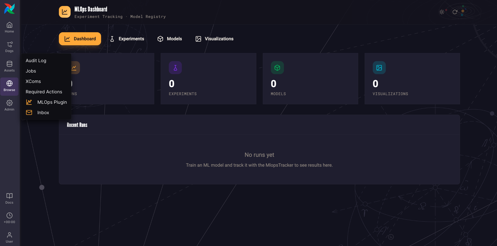

    The MLOps plugin has 4 tabs:

    - **Runs**: Every time a model is trained for any experiment, a Run is created that will be listed here.
    - **Experiments**: An experiment is one problem you are trying to solve with an ML model and typically tied to the outcome you are trying to predict or data you are trying to cluster.
    - **Models**: The models tab lists all models that are trained alongside their versions. 
    - **Visualizations**: This tab stores matplotlib plots showing the test results of trained ML models.

    Right now, the plugin is empty, let's change that and load in the models trained in the MLOps 101 workshop!

2. Go to the Dags overview page (1) and search for the `load_trained_model_examples` Dag (2), click on the Play button (3).

    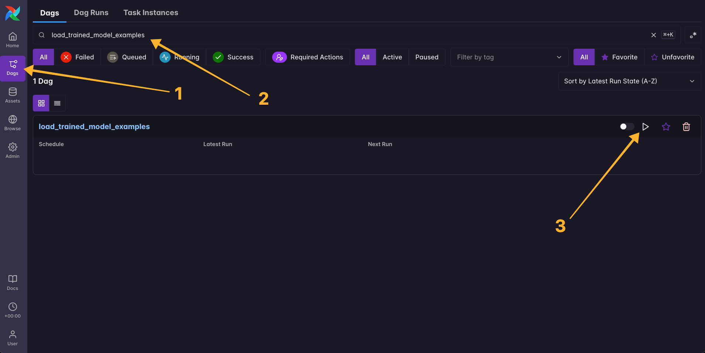

3. In the popup, trigger a Single Run of the Dag by clicking the **Trigger** button. Wait for the run to finish (you'll see a green checkmark next to the timestamp of the "Latest Run"). If you are running this workshop in a cloud environment like the Astro IDE it might take a minute for the worker to spin up.

4. Go back to the MLOps plugin (**Browse** -> **MLOps Plugin**). You should see 12 runs now training 6 different models for 3 experiments. Each run has an associated visualization. 

    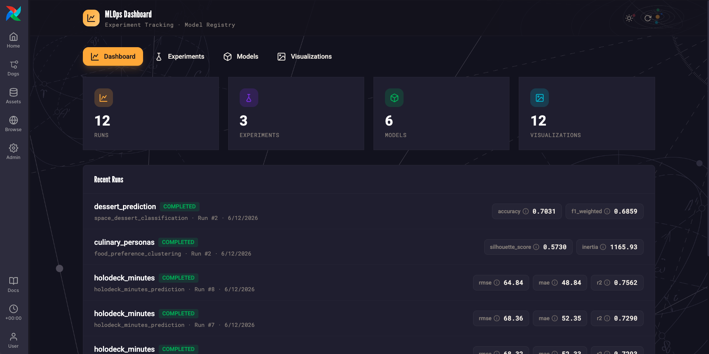

5. Click on the **Experiments** tab. Clicking on the row of an experiment will show you how different runs (hopefully) improved the model metrics over time. Clicking on any model run will show you the details and visualizations of an individual run.
 
    The 3 experiments are:

    - `holodeck_minutes`: Trying to predict how many minutes each passenger will spend on the holodeck during their journey in order to allocate compute resources (all AstroTrips ships are of course fitted with latest generation holodecks). 4 models were trained for this experiment, with 2 runs each. Over time thanks to added features and tuning of hyperparameters the models got significantly better. You can see RMSE (Root Mean Squared Error, a measurement for the model error) go down and R2 (R squared, a measurement for how much % of the target value can be predicted by the model) go up over time. Yay! 
    - `dessert_prediction`: The second experiment tried to predict which dessert each passenger would order each day of their trip, vital for catering planning! There are 2 runs here for one model, which improved when more features were added. Click on Run 2 to see a visualization of our predictions, still some errors but we correctly predicted that Seldons's Swirl (our in-house produced ice cream) would be a hit!.

    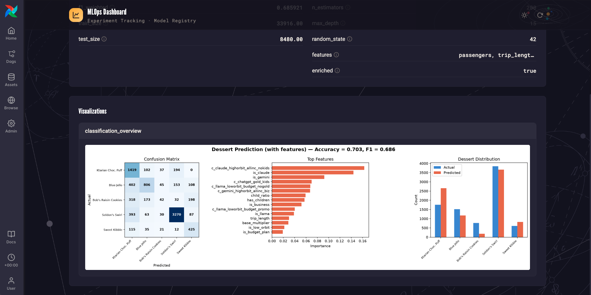  

    - `culinary_personas`: The final experiment is about trying to find out if our passenger's can be sorted into different clusters according to how much money they spend on on board food. The results of the second run here are solid. There seems to be a distinction between high, mid-range and low-cost spenders.

The `culinary_personas` clustering can only sort passengers *after* they have spent money on board (their food spend is one of its inputs). What AstroTrips actually needs is to estimate spend *before* a trip, from what we know at booking time (party size, trip length, destination, loyalty tier, ...). The fact that spend falls into clear high, mid-range and low-cost groups is a good hint that it is predictable from thos and similar features. Predicting a continuous value like spend per person per day is a **regression** challenge, and you'll solve it!

# Exercise 2: Train a regression model with traditional features

1. In the Airflow UI, run the `setup` Dag using the play button.

    

**Once the Dag run completes successfully, your database is ready.**

> [!IMPORTANT]
> Running this Dag resets and re-creates the database AND the MLOps plugin to this state. If you encounter any issues in the following exercises, simply run this Dag again for a clean slate.

2. Let's add a Dag that uses this data to engineer features for a regression model. Create a new file in the `dags` folder called `feature_engineering_traditional.py` and add the code below.

```python
from airflow.sdk import chain, dag, task
from datetime import datetime
from include.aimlops.assets import DETERMINISTIC_FEATURES_READY

_SOURCE_TABLES = [
    "bookings",
    "payments",
    "routes",
    "planets",
    "customers",
    "promo_codes",
    "cosmarket_orders",
    "menu_items",
    "meal_orders",
]


@dag(start_date=datetime(2026, 6, 1), schedule="@daily", tags=["exercise 2"])
def feature_engineering_traditional():

    @task
    def extract_history() -> dict:
        import json

        from include.aimlops.persistence import load_records

        history = {t: load_records(t) for t in _SOURCE_TABLES}
        return json.loads(json.dumps(history, default=str))

    @task
    def compute_features_and_labels(history: dict) -> dict:
        from include.aimlops.spend_features import (
            build_frames,
            compute_spend_features,
            compute_spend_labels,
        )

        frames = build_frames(history)
        return {
            "features": compute_spend_features(frames).to_dicts(),
            "labels": compute_spend_labels(frames).to_dicts(),
        }

    @task(outlets=[DETERMINISTIC_FEATURES_READY])
    def write_features(payload: dict) -> None:
        from include.aimlops.persistence import (
            get_duckdb_conn,
            replace_table,
            sync_table_to_variable,
        )
        from include.aimlops.spend_features import FEATURE_COLUMNS

        with get_duckdb_conn() as conn:
            replace_table(conn, "spend_features", FEATURE_COLUMNS, payload["features"])
            replace_table(
                conn,
                "spend_labels",
                ["booking_id", "food_spend_pp_pd"],
                payload["labels"],
            )

        sync_table_to_variable("spend_features")
        sync_table_to_variable("spend_labels")

    _history = extract_history()
    _features = compute_features_and_labels(_history)
    _written = write_features(_features)
    chain(_history, _features, _written)


feature_engineering_traditional()
```

3. If you are using the Astro IDE, sync your changes to the test deployment. If you are using the Astro CLI, run `astro dev run dags reserialize` for the Dag to show up without having to wait for the next Dag processor parse.

4. Search for the Dag in the Dags list and click on the Dag name and then on the graph icon (or use the shortcut `g`) to see the graph.

    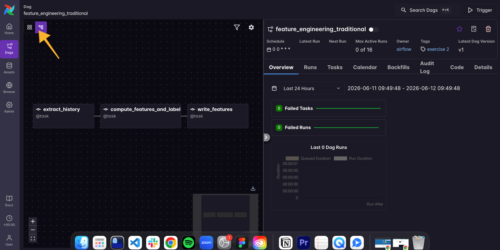

5. It is a simple Dag with 3 tasks: one to gather the data about passengers who completed their journey with us from the database, the next to compute the features and the target label, and the last task to write the features to a new table in the database. This structure likely feels familiar: feature engineering follows an ETL pattern! You'll also notice that most of the logic, the polars code actually creating the features, is modularized. This is because at inference time, features have to be computed for prospective passengers, the modularization means we can use the exact same functions in the inference Dag in exercise 3.

6. Next, we'll add the Dag that trains the model based on these features. Create a new file in the Dags folder called `train_spend_model.py` and add the following code. Safe the file and syn to your test deployment (Astro IDE) or run `astro dev run dags reserialize` (Astro CLI).

```python
from datetime import datetime, timedelta

from airflow.sdk import chain, dag, task

from include.aimlops.assets import MODEL_REGISTERED, PLUGIN_SYNC

_EXPERIMENT = "food_spend_prediction"
_MODEL_NAME = "spend_model"

_N_ESTIMATORS = [200]
_MAX_DEPTH = [6]

_LR_ALPHA = [0.1, 0.5]
_LR_L1_RATIO = [0.2, 0.5]


@dag(
    start_date=datetime(2026, 1, 1),
    schedule=None,
    tags=["exercise 2"],
    max_active_tasks=1,  # local db only allows one concurrent write
    default_args={"retries": 3, "retry_delay": timedelta(seconds=10)},
    doc_md=__doc__,
)
def train_spend_model():

    @task
    def assemble_training_set() -> dict:
        import polars as pl

        from include.aimlops.persistence import load_records
        from include.aimlops.spend_features import one_hot_encode
        categorical_cols = ["destination_planet", "home_planet"]

        df = pl.DataFrame(load_records("spend_features")).join(
            pl.DataFrame(load_records("spend_labels")), on="booking_id", how="inner"
        )

        # After you complete exercise 3 this part will read in the AI-generated features
        ai_records = load_records("ai_features")
        use_ai = len(ai_records) > 0
        if use_ai:
            df = df.join(pl.DataFrame(ai_records), on="booking_id", how="left")
            categorical_cols += ["trip_occasion", "enthusiasm", "budget_signal"]

        df = one_hot_encode(df, categorical_cols)

        y = df["food_spend_pp_pd"].to_list()
        X = df.drop("booking_id", "food_spend_pp_pd")
        return {
            "feature_names": X.columns,
            "X": X.to_numpy().tolist(),
            "y": y,
            "feature_set": "ai" if use_ai else "deterministic",
        }

    @task(max_active_tis_per_dagrun=1)  # local db only allows one concurrent write
    def train_random_forest(n_estimators: int, max_depth: int, training_set: dict) -> dict:
        import numpy as np
        from sklearn.ensemble import RandomForestRegressor
        from sklearn.model_selection import train_test_split

        from include.aimlops.training import evaluate_regression
        from include.mlops_tracking import MlopsTracker

        X = np.array(training_set["X"], dtype=float)
        y = np.array(training_set["y"], dtype=float)
        feature_set = training_set["feature_set"]

        X_train, X_test, y_train, y_test = train_test_split(
            X, y, test_size=0.2, random_state=42
        )
        model = RandomForestRegressor(
            n_estimators=n_estimators, max_depth=max_depth, random_state=42
        )
        model.fit(X_train, y_train)
        preds = model.predict(X_test)

        params = {
            "model_type": "RandomForestRegressor",
            "n_estimators": n_estimators,
            "max_depth": max_depth,
            "features": training_set["feature_names"],
            "feature_set": feature_set,
            "enriched": feature_set == "ai",
            "test_size": 0.2,
            "random_state": 42,
            "feature_importances": dict(
                zip(training_set["feature_names"], model.feature_importances_.tolist())
            ),
        }
        metrics = {
            **evaluate_regression(y_test, preds),
            "train_size": len(X_train),
            "test_size": len(X_test),
        }

        model_name = f"{_MODEL_NAME}_random_forest_regressor"
        tracker = MlopsTracker()
        run_id = tracker.start_run(
            experiment_name=_EXPERIMENT,
            dag_id="train_spend_model",
            task_id="train_variant",
            tags={"feature_set": feature_set, "n_estimators": n_estimators, "max_depth": max_depth},
        )
        tracker.log_params(run_id, params)
        tracker.log_metrics(run_id, metrics)
        model_version = tracker.log_model(run_id, model_name, "RandomForestRegressor", model)
        tracker.end_run(run_id)

        return {
            "run_id": run_id,
            "model_name": model_name,
            "model_version": model_version,
            "model_type": "RandomForestRegressor",
            "n_estimators": n_estimators,
            "max_depth": max_depth,
            "rmse": metrics["rmse"],
            "r2": metrics["r2"],
            "metrics": metrics,
            "params": params,
            "feature_cols": training_set["feature_names"],
            "importances": model.feature_importances_.tolist(),
            "importance_label": "Importance",
            "y_test": y_test.tolist(),
            "y_pred": preds.tolist(),
        }

    @task(max_active_tis_per_dagrun=1)
    def train_linear(alpha: float, l1_ratio: float, training_set: dict) -> dict:
        import numpy as np
        from sklearn.linear_model import ElasticNet
        from sklearn.model_selection import train_test_split
        from sklearn.pipeline import Pipeline
        from sklearn.preprocessing import StandardScaler

        from include.aimlops.training import evaluate_regression
        from include.mlops_tracking import MlopsTracker

        X = np.array(training_set["X"], dtype=float)
        y = np.array(training_set["y"], dtype=float)
        feature_set = training_set["feature_set"]
        feature_names = training_set["feature_names"]

        X_train, X_test, y_train, y_test = train_test_split(
            X, y, test_size=0.2, random_state=42
        )
        model = Pipeline(
            [
                ("scaler", StandardScaler()),
                ("elasticnet", ElasticNet(alpha=alpha, l1_ratio=l1_ratio, random_state=42)),
            ]
        )
        model.fit(X_train, y_train)
        preds = model.predict(X_test)

        en = model.named_steps["elasticnet"]
        params = {
            "model_type": "ElasticNet",
            "alpha": alpha,
            "l1_ratio": l1_ratio,
            "features": feature_names,
            "feature_set": feature_set,
            "enriched": feature_set == "ai",
            "test_size": 0.2,
            "random_state": 42,
            "coefficients": dict(zip(feature_names, en.coef_.tolist())),
            "intercept": float(en.intercept_),
        }
        metrics = {
            **evaluate_regression(y_test, preds),
            "train_size": len(X_train),
            "test_size": len(X_test),
        }

        model_name = f"{_MODEL_NAME}_elastic_net"
        tracker = MlopsTracker()
        run_id = tracker.start_run(
            experiment_name=_EXPERIMENT,
            dag_id="train_spend_model",
            task_id="train_linear",
            tags={"feature_set": feature_set, "alpha": alpha, "l1_ratio": l1_ratio},
        )
        tracker.log_params(run_id, params)
        tracker.log_metrics(run_id, metrics)
        model_version = tracker.log_model(run_id, model_name, "ElasticNet", model)
        tracker.end_run(run_id)

        return {
            "run_id": run_id,
            "model_name": model_name,
            "model_version": model_version,
            "model_type": "ElasticNet",
            "alpha": alpha,
            "l1_ratio": l1_ratio,
            "rmse": metrics["rmse"],
            "r2": metrics["r2"],
            "metrics": metrics,
            "params": params,
            "feature_cols": feature_names,
            "importances": en.coef_.tolist(),
            "importance_label": "Coefficient",
            "y_test": y_test.tolist(),
            "y_pred": preds.tolist(),
        }

    @task
    def select_best(forest_variants: list[dict], linear_variants: list[dict]) -> dict:
        return min([*forest_variants, *linear_variants], key=lambda v: v["rmse"])

    @task
    def visualize(best: dict) -> dict:
        from include.aimlops.training import describe_model
        from include.ml_plots import plot_regression
        from include.mlops_tracking import MlopsTracker

        title = (
            f"Food Spend per Day per Person | {describe_model(best)} | "
            f"R2 = {best['metrics']['r2']:.3f}, RMSE = {best['metrics']['rmse']:.2f}"
        )
        return plot_regression({**best, "plot_title": title}, MlopsTracker())

    @task(outlets=[MODEL_REGISTERED, PLUGIN_SYNC])
    def register_model(best: dict) -> None:
        from include.mlops_tracking import MlopsTracker

        MlopsTracker().promote_model(best["model_name"], best["model_version"], stage="production")


    _set = assemble_training_set()
    _forest = train_random_forest.partial(training_set=_set).expand(
        n_estimators=_N_ESTIMATORS, max_depth=_MAX_DEPTH
    )
    _linear = train_linear.partial(training_set=_set).expand(
        alpha=_LR_ALPHA, l1_ratio=_LR_L1_RATIO
    )
    _best = select_best(_forest, _linear)
    _plot = visualize(_best)
    _registered = register_model(_best)
    chain(_set, [_forest, _linear], _best, _plot, _registered)


train_spend_model()
```

7. Run the model `train_spend_model.py` Dag. 

    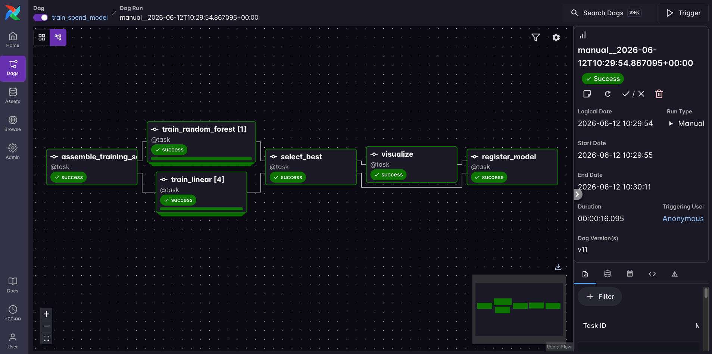

    This Dag is a little more complex, it has 6 tasks:
    
    - `assemble_training_set`: Gathers the features the previous Dag engineered,  performs a hot-encoding step for the categorical features, and returns labels and features separatedly for the training tasks.
    - `train_linear`: Trains a ElasticNet model. The task is dynamically mapped over hyperparameter inputs, create a cross product between the two hyperparameters that are turned: `_LR_ALPHA` and `_LR_L1_RATIO`. This results in 2x2=4 mapped task instances. For each version, the data gets split into a train and test set, the model is trained and lastly tested.
    - `train_random_forest`: Trains a RandomForestRegressor model. The task is dynamically mapped over hyperparameter inputs, but since we are only providing one input per parameter, there is only 1 dynamically mapped task instance.
    - `select_best`: This task selects the model that performed best when trying to predict testing data, based on the lowest RSME (Root squared mean error).
    - `visualize`: Creates a visualization for the best model.
    - `register_model`: Registers the best model as the one to be used in inference. 

![NOTE]
> If you run into any issues while running these Dags in the Astro IDE, your tasks might be running on a worker that does not have the duckdb file. Just rerun from the `setup` Dag and `feature_engineering_traditional` Dag to recreate the DB with features for model training.

8. Go to the MLOps plugin (**Browse** -> **MLOps plugin**) you now have added a 4th experiment `food_spend_prediction` with 5 runs (4 versions of the ElasticNet model, 1 version of the RandomForestRegressor model). The best model is the one with the lowest RMSE, in the screenshot below Run #3.

    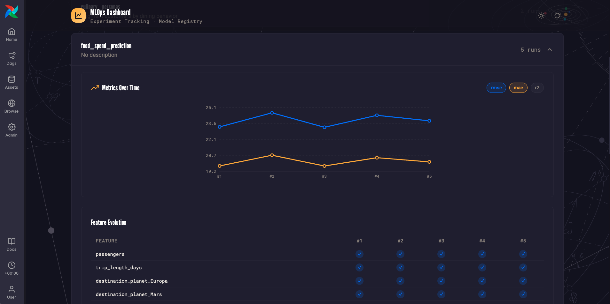

9. Open Run #3. The visualizaion shows you prediced vs actual spend, as well as the residuals and coefficients. In the case of ElasticNet, which is a type of linear regression, you can interpret the coefficients directly! A positive coefficient means this feature made a person more likely to spend more per day on catering (`cosmarket_dessert_share` seems to be the strongest predictor, those who order more desserts from our galatic store also spend more on in-flight food!). A negative coefficient means the feature is associated with less spend. Apparently people travelling to Europa spend less on food.

    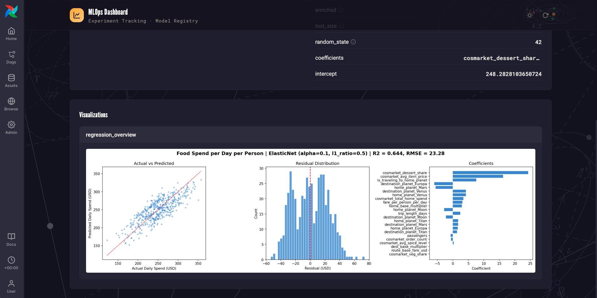


This model is not bad, we can predict about 64% of our prospective passenger's food spend with it! But it could be better. We could tune the hyperparameters, or we look if we can create additional features that might predict someone's food spend.

A lot of passengers send us emails before they start their trip. This is unstructured data that contains valuable information, like a person asking for a discount might be budget conscious, meanwhile someone who is very excited for their trip might spend more! LLMs allow us to turn unstructured data into structured features! Let's use AI to engineer features in the next exercise!

# Exercise 2: Train a regression model with traditional features

The `feature_engineering_ai` Dag creates features from the prospect emails that are not in the structured tables. An agent reads each email and extracts three categorical features: trip occasion, enthusiasm, and budget signal.

![NOTE]
> Running the agent on every row of the historical data would create one agentic task per booking, which is a bit excessive token spend for a workshop demo, so it only runs on five recent prospect emails during the workshop here to show the pattern. The rest of the AI features are pre-computed and added to the feature engineering table by the `fill_historical_features` task.

1. Create a new file in your Dags folder called `feature_engineering_ai.py` and copy the following code:

```python
from typing import Literal

from airflow.sdk import chain, dag, task
from pydantic import BaseModel, Field

from include.aimlops.assets import AI_FEATURES_READY
from include.prompts import FEATURE_EXTRACTION_SYSTEM_PROMPT

_LLM_CONN_ID = "pydanticai_default"
_MAX_PROSPECT_EMAILS = 5


class ProspectFeatures(BaseModel):
    """Enum features extracted from email text, one-hot encoded for the regression."""

    trip_occasion: Literal[
        "celebration", "family", "business", "budget", "adventure", "other"
    ] = Field(description="What kind of trip the prospect is planning")
    enthusiasm: Literal["low", "medium", "high"] = Field(
        description="How eager and ready to book the prospect sounds"
    )
    budget_signal: Literal["low", "medium", "high"] = Field(
        description="low = cost-conscious language, high = premium / price-insensitive"
    )


@dag(tags=["exercise 3"])
def feature_engineering_ai():

    @task
    def load_prospect_emails() -> list[dict]:
        from include.aimlops.persistence import load_records

        inbound = [
            {"thread_id": m["thread_id"], "body": m["body"]}
            for m in load_records("email_messages")
            if m["direction"] == "inbound"
        ]
        return inbound[:_MAX_PROSPECT_EMAILS]

    @task.agent(
        llm_conn_id=_LLM_CONN_ID,
        output_type=ProspectFeatures,
        system_prompt=FEATURE_EXTRACTION_SYSTEM_PROMPT,
    )
    def extract_features(email: dict) -> str:
        return f"Extract the features from this prospect email:\n\n{email['body']}"

    @task
    def fill_historical_features() -> None:
        from include.aimlops.ai_features import synthetic_ai_features
        from include.aimlops.persistence import get_duckdb_conn, load_records, replace_table

        records = synthetic_ai_features(load_records("bookings"))
        columns = ["booking_id", "trip_occasion", "enthusiasm", "budget_signal"]
        with get_duckdb_conn() as conn:
            replace_table(conn, "ai_features", columns, records)

    @task(outlets=[AI_FEATURES_READY])
    def write_features(extracted: list) -> None:
        from include.aimlops.persistence import get_duckdb_conn, sync_table_to_variable

        def _field(item, name):
            return item[name] if isinstance(item, dict) else getattr(item, name)

        with get_duckdb_conn() as conn:
            for booking_id, feat in enumerate(extracted, start=1):
                conn.execute(
                    "UPDATE ai_features SET trip_occasion = ?, enthusiasm = ?, "
                    "budget_signal = ? WHERE booking_id = ?",
                    [
                        _field(feat, "trip_occasion"),
                        _field(feat, "enthusiasm"),
                        _field(feat, "budget_signal"),
                        booking_id,
                    ],
                )
        sync_table_to_variable("ai_features")

    _emails = load_prospect_emails()
    _extracted = extract_features.expand(email=_emails)
    _filled = fill_historical_features()
    _written = write_features(_extracted)
    chain(_filled, _written)


feature_engineering_ai()
```

This Dag again follows the familar ETL pattern, but this time the transformation, which transforms unstructured emails into structured data (`trip_occasion`, `enthusiasm` and `budget_signal`), uses `@task.agent` from the [Common AI provider package](https://www.astronomer.io/docs/learn/airflow-common-ai-provider), an agentic task! 

2. Run the `feature_engineering_ai` Dag.

![NOTE]
> If you run into any issues while running these Dags in the Astro IDE, your tasks might be running on a worker that does not have the duckdb file. Just rerun from the `setup` Dag and `feature_engineering_traditional` Dag to recreate the DB with features for model training.

3. Run the `train_spend_model` Dag again. This time the training set includes the AI features, running another set of training runs on the same models and hyperparameters.

4. Open the MLOps plugin again and look at the new best model.

    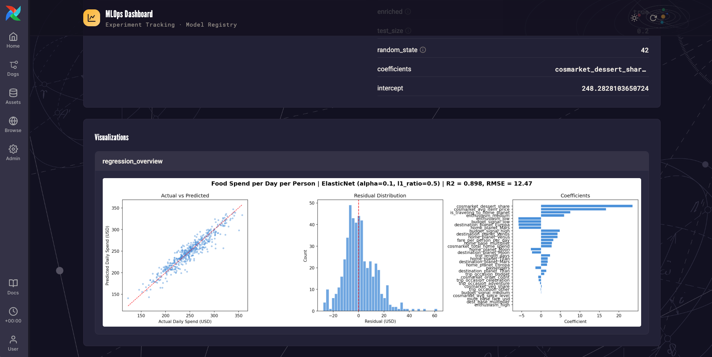

This time the winning model scored an R2 of 0.,898 a clear improvement over only using the deterministic features! You can see that the AI generated feature `enthusiasm_medium` predicted for more food spend, which `enthusiasm_low` or `budget_low` signalled lower food spend.

# Challenge: Mission control

It is time for a challenge. The workshop provides a custom `MissionControlOperator` that generates an interstellar clearance code based on your implementation. Only if the Dag has the correct task IDs and dependencies will the code be valid.

Within your `feature_engineering_ai` Dag:

1. Import the `MissionControlOperator` from `include.mission_control`.
2. Create a task instance with `task_id="mission_control"`.
3. Add it as the **last step** in the Dag (downstream of `write_features`).
4. Sync your changes.
5. Run the `feature_engineering_ai` Dag.
6. Check the `mission_control` task logs for your clearance code and share it!

# Bonus exercise 1: Run Batch inference

Now you can use the best model to predict the catering spend of upcoming trips that are already booked. This is an example of batch inference.

1. Go to [solution/bonus_exercise_1](/solution/bonus_exercise_1/spend_inference.py) and copy the `spend_inference` Dag into the `dags` folder.

2. Run the `spend_inference` Dag. It loads the best model and runs inference for every upcoming trip.

3. Open the logs of the `report_estimates` task. It prints the predicted food spend per trip, along with the expected catering revenue across all pending trips.

```
[2026-06-12 11:15:23] INFO -   customer  dest      pax  days     $pp/day         trip $
[2026-06-12 11:15:23] INFO -   2002      Titan       2    21      221.49        9302.56
[2026-06-12 11:15:23] INFO -   2003      Europa      4    14      205.52       11509.08
[2026-06-12 11:15:23] INFO -   2004      Venus       2     9      252.56        4545.99
[2026-06-12 11:15:23] INFO -   2005      Mars        1    30      215.36        6460.77
[2026-06-12 11:15:23] INFO -   2006      Venus       2     7      236.03        3304.42
[2026-06-12 11:15:23] INFO -   2007      Moon        6     4      286.42        6873.99
[2026-06-12 11:15:23] INFO -   2008      Mars        3    12      252.03        9073.23
[2026-06-12 11:15:23] INFO -   2009      Europa      2    16      218.32        6986.09
[2026-06-12 11:15:23] INFO -   2010      Titan       3    18      234.82       12680.44
[2026-06-12 11:15:23] INFO -   total expected food revenue:       $70,736.59
[2026-06-12 11:15:23] INFO -   estimated catering cost (55% food cost): $38,905.12
[2026-06-12 11:15:23] INFO -   expected catering profit:          $31,831.46
```

## Bonus Exercise 2: Using an ML model as an AI tool

![WARNING]
> This exercise is currently under construction and does not work with the Astro IDE setup yet and might like detailed explanations.

We've used AI to improve our ML model. Let's turn it around and use the trained best ML model to improve an AI output!

AstroTrips recently added a sales agent that replies to inbound prospect emails. 

Open the Email plugin (**Browse** -> **Inbox**) to read the recent threads and their AI replies. Yikes! 
Look at the latest inquiry by William Riker, he asks whether he can bring his pet tribble on his honeymoon to Titan, and the agent deflects because it does not know our pet policy.

The replies are vague and unhelpful, because the agent has no context on AstroTrips! It is just a ChatGPT wrapper.

This AI agent needs context about AstroTrips in general (for example our comprehensive [pet policy](/include/seed_context/pet_policy.md)) and about the specific customer it is replying to. And knowing how much Will Riker is likely to spend on food would be valuable information, at a predicted spend of over 200 dollars per day, we offer complimentary drinks!

4 types of context engineering are needed here:

- **Traditional context engineering**: The AI agent needs to be able to search our proprietary knowledge about AstroTrips.
- **Context layer**: The AI agent needs access to our database to look up information about the specific customer it is answering to personalize the message.
- **Adding tools (Dag-as-a-Tool, DaaT)**: To predict expected spend, the AI agent can use the same ML model trained in the previous exercises! A Dag can be called the Airflow REST API, which means a Dag can be used as an agent tool.
- **Decision trace and context graphs**:

1. Copy the [folder containing the bonus exercise 2 Dags](/solution/bonus_exercise_2/) into the `dags` folder and run `astro dev run dags reserialize`.

2. This will add 5 Dags to your environment:

    - `context_engineering`: turns the AstroTrips policy and product markdown in `include/seed_context` into chunked, embedded context units, giving the agent a searchable knowledge base.
    - `send_riker_email`: drops William Riker's honeymoon-to-Titan inquiry into the inbox as a fresh inbound email, which kicks off the `respond_to_email` agent.
    - `respond_to_email`: the AstroTrips sales agent that drafts a reply to each inbound prospect email using searchable context, customer database lookups, and the spend-prediction Dag-as-a-tool, then routes the draft through a human-in-the-loop approval before sending.
    - `trace_capture`: records the decision trace from each completed `respond_to_email` run, emitting it for the context graph to learn from.
    - `build_context_graph`: distills those captured traces into reusable precedents and adds them to the searchable context, so the agent improves from its own past decisions.

3. Make sure all these Dags, and the `spend_inference` Dag are unpaused in the Airflow UI.

4. Run the `context_engineering` Dag. After this Dag finishes your agent is all set to give much better replies!

5. Run the `send_riker_email` Dag. This Dag will resend the same email from Will Riker, let's see how the agent creates a better response this time.

6. The `respond_to_email` Dag automatically runs after the `send_riker_email` based on an asset schedule. Check out the logs of the `draft_reply` task (1 and 2) to see the tool calls of the agent!

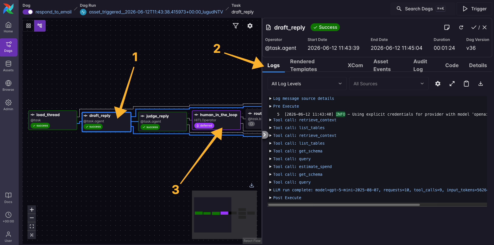

7. The Dag stops at the `human_in_the_loop` task, it is waiting for you to make a decision about the AI-drafted email. Click on the `human_in_the_loop` task (3) and then on `Required Action` read the AI drafted email (or skim it) and scroll down to add any thing in the `Reason / rewrite instructions` field and then click `approve` so the Dag can continue.

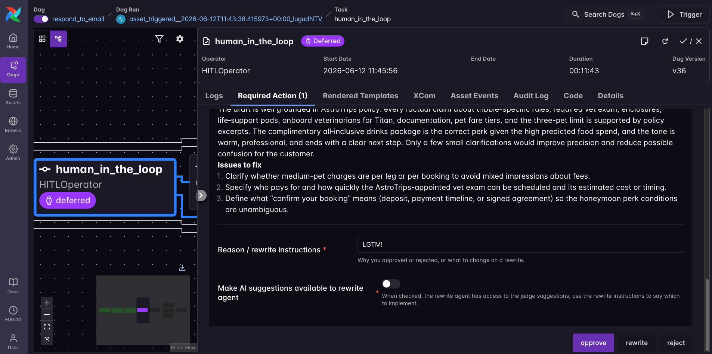

8. Once the Dag has finished you can view the response in the Inbox (**Browse** -> **Inbox** plugin). The `trace_capture` Dag automatically runs after every run of the `respond_to_email` Dag and trace how the decision was made. Once they have finished you'll get an "How this was decided" button on your email reply, click it to explore the decision trace!

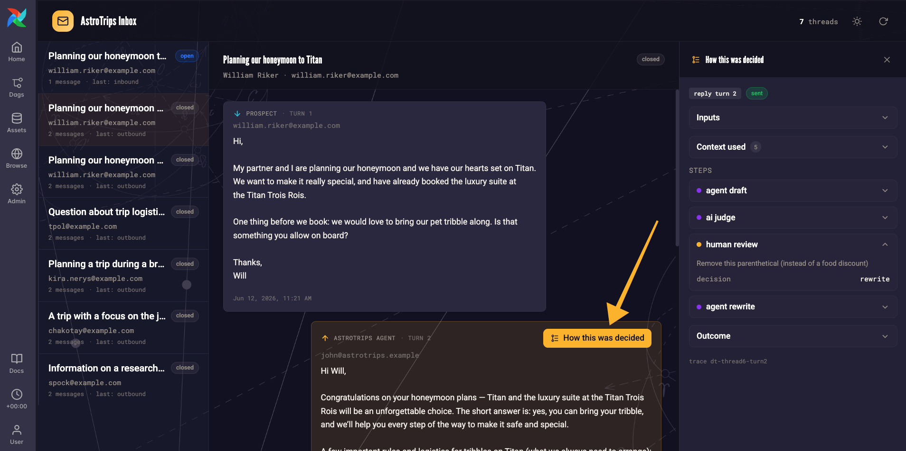

This trace shows that the human wanted one parenthical removed. This is great for auditability but the best part is that the `build_context_graph` collects human overrides and adds them to the context, similar to how our pet policy is stored! You can experiment with rewrite instructions and see how they affect subsequent model runs.