# Airflow MLOps Workshop

## Exercises

- [Exercise 0: Astro, Astro IDE, and the MLOps Dashboard](#exercise-0-astro-astro-ide-and-the-mlops-dashboard)
- [Exercise 1: Add a feature engineering Dag](#exercise-1-add-a-feature-engineering-dag)
- [Exercise 2: Classification: predict dessert choice based on enriched features](#exercise-2-classification-predict-dessert-choice-based-on-enriched-features)
- [Challenge: Mission control](#challenge-mission-control)
- [Exercise 3: Regression: Hyperparameters and dynamic task mapping](#exercise-3-regression-hyperparameters-and-dynamic-task-mapping)
- [Exercise 4: Clustering: Find spending groups of customers](#exercise-4-clustering-find-spending-groups-of-customers)

---

# Exercise 0: Astro, Astro IDE, and the MLOps Dashboard

## Set Up Astro IDE

This workshop does not require any local Airflow installation. Instead, all development takes place within Astro and the Astro IDE.

1. Create a [free trial of Astro](https://www.astronomer.io/lp/signup/?utm_source=conference&utm_medium=web&utm_campaign=devrel-workshop).

 - After creating an account, verifying your email, and logging in, choose _Personal_ in the first step.
 - Next, choose an _Organization_ and _Workspace_ name. These can be fictional names and you can change them later.
 - In the third step, click the small link at the bottom under the two boxes: _Or skip this and go to your workspace_.

    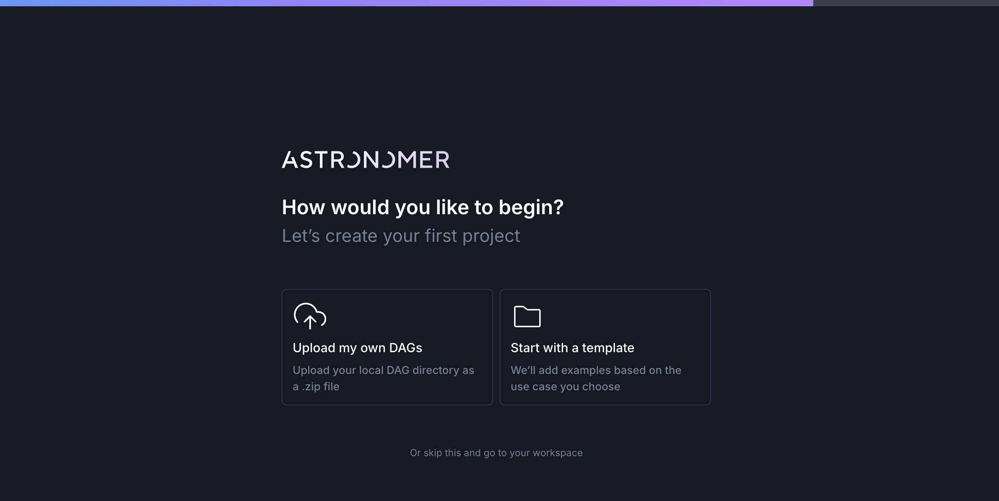

 - You should now see the Astro platform UI.

2. Open the _Astro IDE_ from the left navigation and select _Connect Git project..._
3. Under _Select a Git provider for manual configuration_, select _GitHub_ and enter the following details:

 - **ACCOUNT**: `astronomer`
 - **REPOSITORY**: `devrel-public-workshops`
 - _Keep Astro Project Path empty_
 - **BRANCH**: `workshops/astrotrips/mlops-101`
 - **AUTHENTICATION TYPE**: `None (public repository)`
 - Click _Connect_. The IDE will import and open the project for you.

    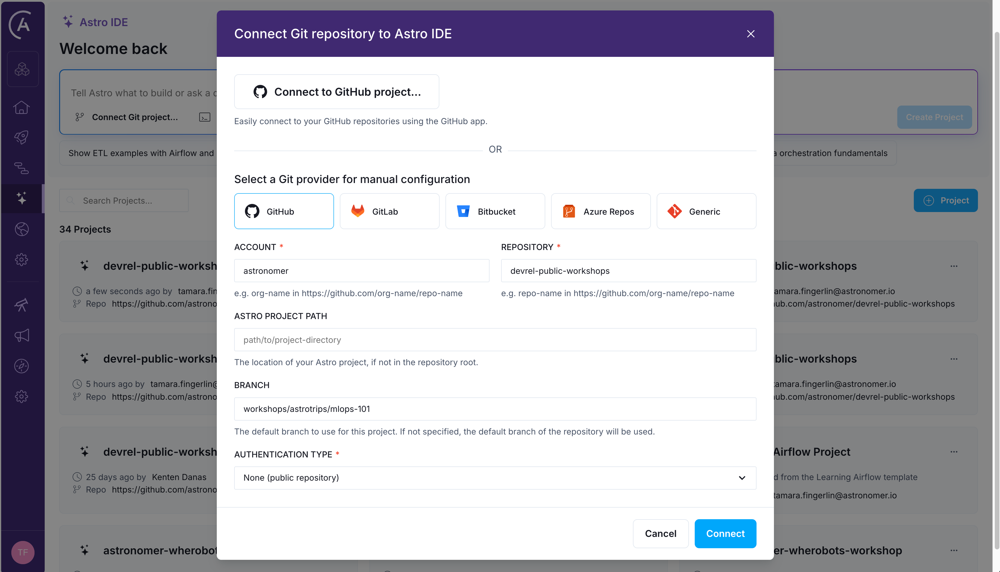

**You now have the Astro IDE with the project ready to go.**

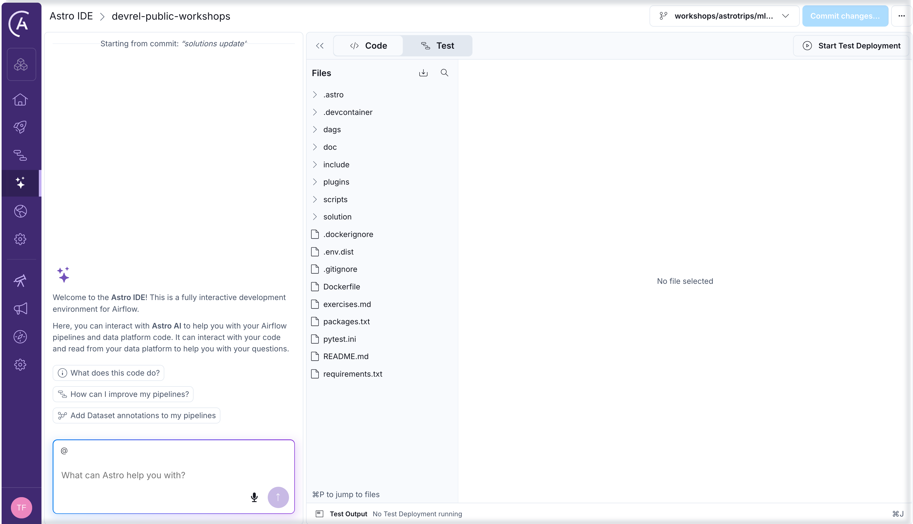

> [!NOTE]
> You don't need to commit your changes. If you want to keep your code after the workshop, fork the repository first.

> [!TIP]
> The Astro IDE comes with an integrated AI assistant, optimized for workflow orchestration with Apache Airflow. Feel free to interact with it during this workshop to learn more about certain concepts.

## Set Up the Connection

This workshop relies on a DuckDB database. To ensure your test environments can connect to it, the next step is to create a workspace-wide connection.

> [!NOTE]
> The next two steps take place in the main Astro platform UI, not inside the Astro IDE. If you collapsed the sidebar, expand it to navigate.

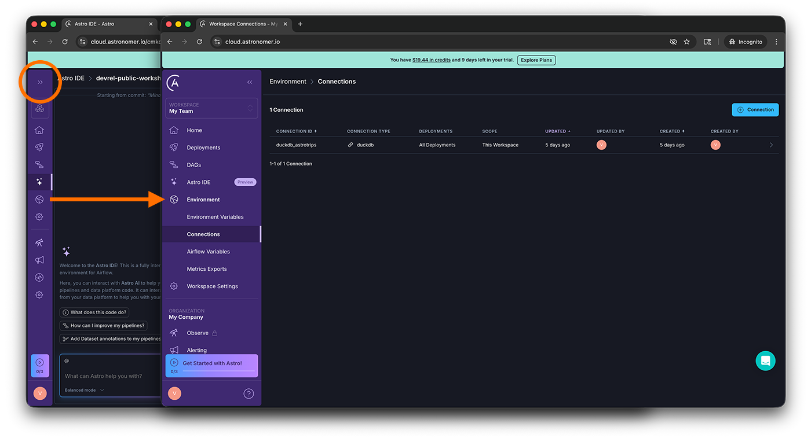

1. In Astro, navigate to _Environment_ → _Connections_ and click the _+ Connection_ button.
2. In the dialog, search for and select _Generic_, then enter the following details:

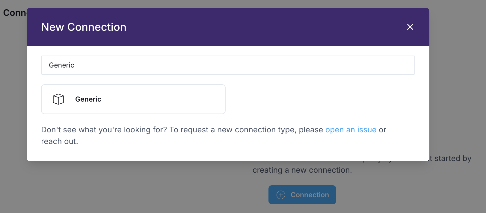

 - **CONNECTION ID**: `duckdb_astrotrips`
 - **TYPE**: `duckdb`
 - **HOST**: `include/astrotrips.duckdb`
 - Set **AUTOMATICALLY LINK TO ALL DEPLOYMENTS** to _On_

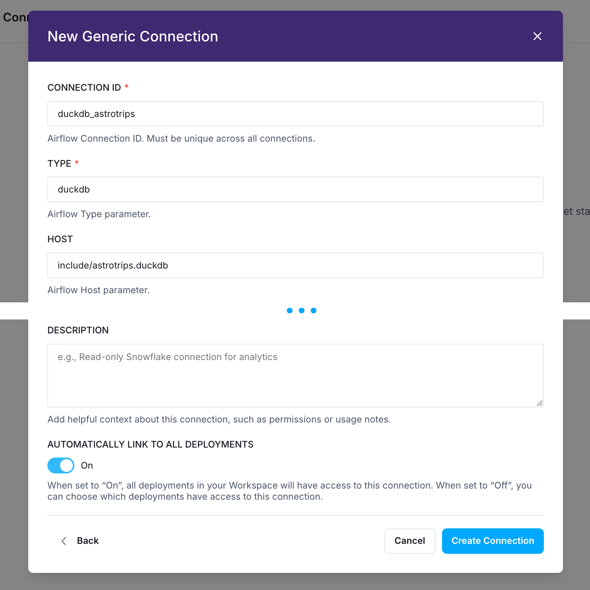

3. Click _Create Connection_.

> [!TIP]
> Learn more about [Airflow connections](https://www.astronomer.io/docs/learn/connections).

## Start the test deployment and run the setup Dag

1. Navigate to the _Astro IDE_ and click _Start Test Deployment_ in the top right corner. The deployment takes 3-5 minutes to spin up.
2. While the deployment is starting, click the dropdown next to _Sync to Test_ and select _Test Deployment Details_.

    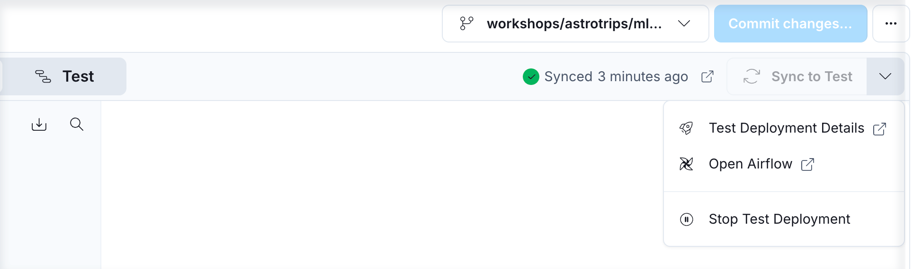

3. Navigate to the _Environment_ tab and click _Edit Deployment Variables_.
4. In the popup, remove the `AIRFLOW__SCHEDULER__USE_JOB_SCHEDULE` variable to enable scheduling for the test deployment.
5. Click _Update Environment Variables_.

    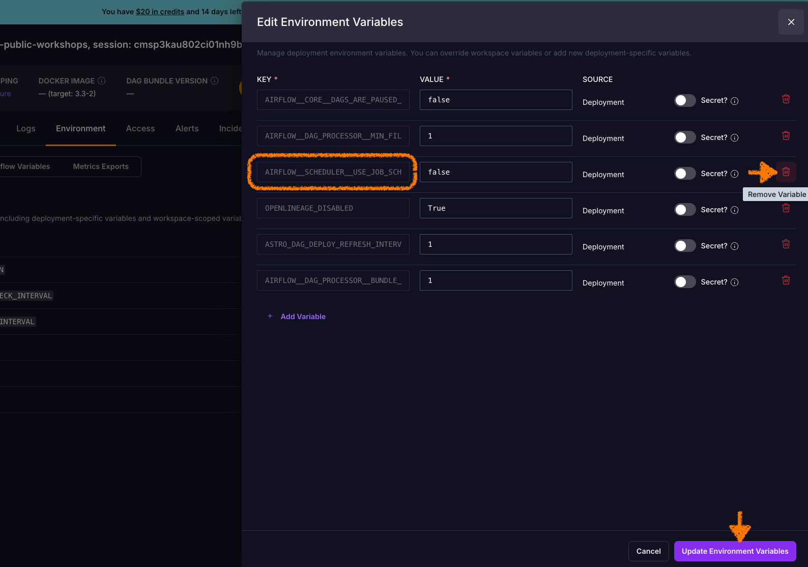

> [!NOTE]
> Scheduling is disabled by default for test deployments to prevent Dags from running automatically. This gives you maximum control during development and helps avoid unwanted side effects. However, for this workshop, we want Dags to be scheduled based on asset updates, so we enable scheduling accordingly.

6. Once the test deployment is ready, select _Open Airflow_, from the same dropdown menu.

    

7. In the Airflow UI, run the `setup` Dag using the play button.

    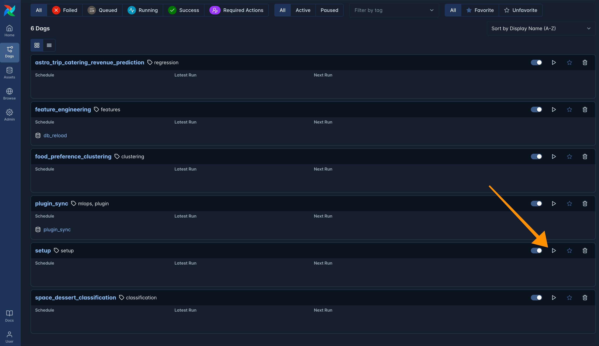

**Once the Dag run completes successfully, your database and pre-seeded ML tracking data are ready.**

> [!IMPORTANT]
> Running this Dag resets and re-creates the database. If you encounter any issues in the following exercises, simply run this Dag again.

## The Airflow Dags 

There are 4 main Dags in the project that you will modify to complete the exercises:

- `feature_engineering`: Builds the `booking_meal_features` table from raw data. In exercise 1 you will complete this Dag, so the features are added to your database.
- `space_dessert_classification`: Trains the dessert-choice classifier ([RandomForest](https://scikit-learn.org/stable/modules/generated/sklearn.ensemble.RandomForestClassifier.html)). In exercise 2 you will run this Dag with the enriched features.
- `astro_trip_catering_revenue_prediction`: Predicts the daily catering revenue per booking party using a [LinearRegression](https://scikit-learn.org/stable/modules/generated/sklearn.linear_model.LinearRegression.html) model. In exercise 3 you will add dynamic task mapping to this Dag to train multiple models with different hyperparameters.
- `food_preference_clustering`: Performs [KMeans](https://scikit-learn.org/stable/modules/generated/sklearn.cluster.KMeans.html) clustering of customer food preferences. In exercise 4 you will modify the hyperparameters of this model.

Additionally, two helper Dags make it easier to run the workshop:

- `setup`: Creates the DuckDB schema, loads fixtures, seeds ML tracking data
- `plugin_sync`: Automatically reads all ML tracking data from DuckDB, writes to Airflow Variable for display in the MLOps plugin. This is a workaround to not necessitate having access to a persistent external database for the workshop.

## The MLOps plugin 

The [MLOps plugin](plugins/airflow-mlops-plugin) is a custom Airflow plugin that provides a dashboard that tracks ML experiments, runs, models, and visualizations. 

1. Open the MLOps plugin in the Airflow sidebar by clicking on **Browse** and then **MLOps Plugin**.

    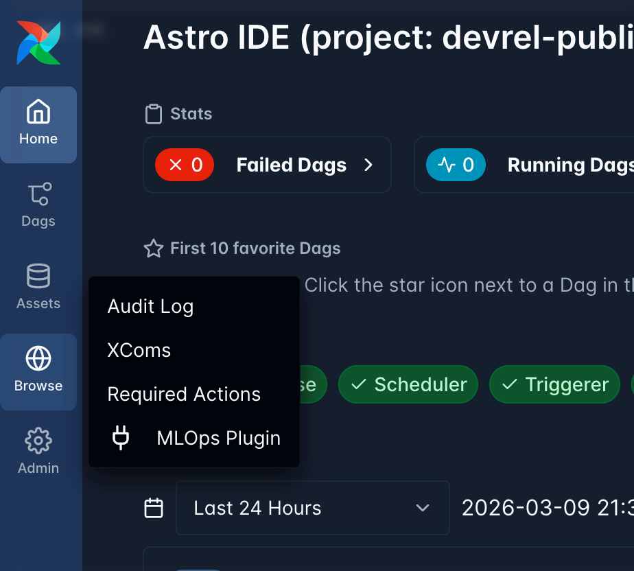

After running the setup Dag, it is pre-seeded with one baseline run for each of the three ML use cases. 

- **Classification**: `dessert_prediction`
- **Regression**: `daily_catering_revenue`
- **Clustering**: `culinary_personas`

    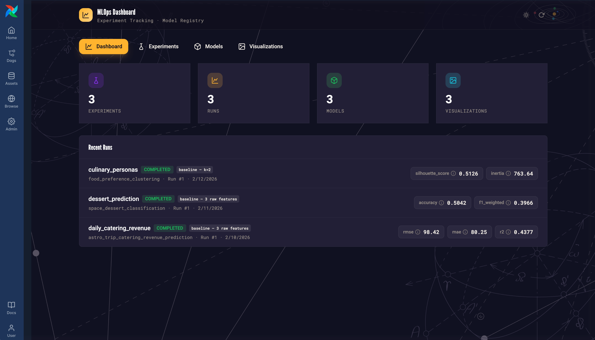

2. Click on the `dessert_prediction` entry to see more details about the run. 

    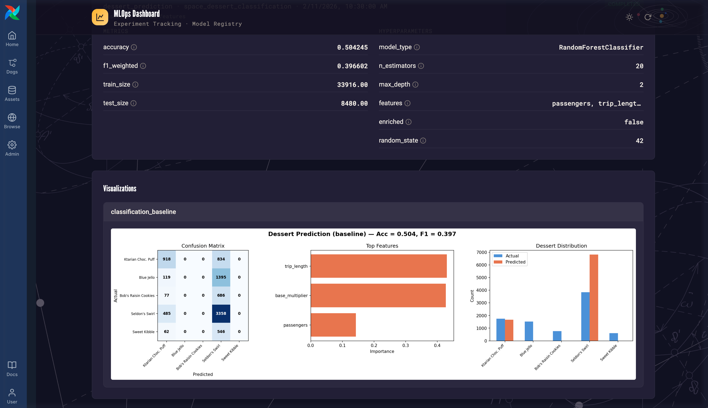

You can see that the model that was just trained on raw features (passengers, trip_length, base_multiplier) is not very good, it only has an accuracy of `0.50`! It gets there by just predicting the two most common dessert choices `Ktarian Chocolate Puff` and `Seldon's Psychohistory Swirl`. We should engineer some better features to improve the model!

## Exercise 1: Complete and run the feature engineering Dag

In this exercise you will complete the partial implementation of the feature engineering Dag to make our models more accurate.

1. Open `dags/feature_engineering.py` in the Astro IDE.

2. There are already several tasks that create derived features in this Dag. Let's add one to create compound interaction features (those start with `c_`). The code creating these features already exists in `include/feature_helpers.py` as the `compound_scores` function, we just need to import the function and call it in a new task. Add this task below the `booking_demographics` task.

```python
    @task
    def compound_scores(trip_data, demo_data):
        import pandas as pd
        from include.feature_helpers import compound_scores as _fn

        return _fn(
            pd.DataFrame(trip_data),
            pd.DataFrame(demo_data),
        ).to_dict(orient="list")
```

3. All these new features need to be saved to the database. Add a new task to save the features to the database.

```python
    @task
    def save_features(trip_data, demo_data, compound_data):
        import pandas as pd
        from airflow.sdk.bases.hook import BaseHook

        keys = ["booking_id", "trip_day", "meal_type"]
        dfs = [
            pd.DataFrame(d) for d in [trip_data, demo_data, compound_data]
        ]
        result = dfs[0]
        for df in dfs[1:]:
            result = result.merge(df, on=keys, how="left")

        hook = BaseHook.get_connection(_CONN_ID).get_hook()
        conn = hook.get_conn()
        conn.execute("DROP TABLE IF EXISTS booking_meal_features")
        conn.register("_bmf", result)
        conn.execute("CREATE TABLE booking_meal_features AS SELECT * FROM _bmf")
        conn.unregister("_bmf")
        conn.close()
```

4. Add the dependencies between the new tasks at the bottom of the Dag. The compound scores depend on both `trip_context` and `booking_demographics` and the save features task depends on `trip_context`, `booking_demographics` and `compound_scores`.

```python
    _compound_scores = compound_scores(_trip_context, _booking_demographics)
    save_features(
        _trip_context,
        _booking_demographics,
        _compound_scores,
    )
```

5. You will want the `feature_engineering` Dag to automatically run whenever you rerun the `setup` Dag. For this you can use asset-based scheduling. In the `@dag` decorator, add `schedule=[Asset("db_reload")]` to the Dag. This asset receives an update whenever the `seed_ml_tracking` task in the `setup` Dag completes successfully.

```python
@dag(tags=["features"], schedule=[Asset("db_reload")])
def feature_engineering():
```

6. Sync your changes in the Astro IDE by clicking the **Sync to Test** button in the top right corner.

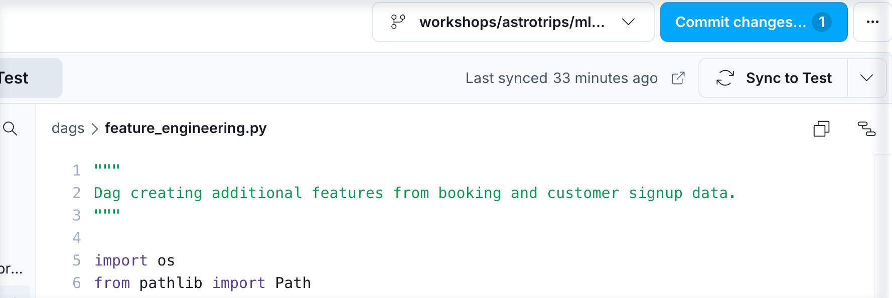

7. In the Airflow UI, click on the Dag name to open the Dag details page.

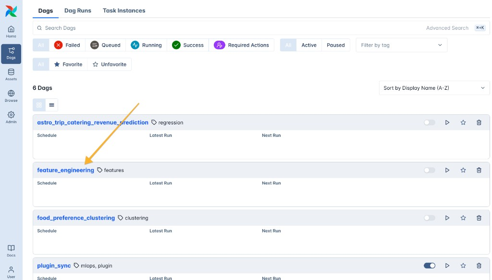

8. Use the toggle or the `g` shortcut to switch between the grid and graph view. In the graph you should see your new tasks and their dependencies.

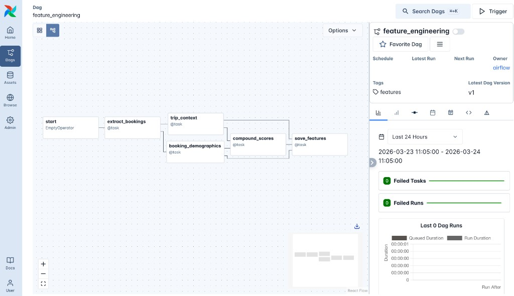

9. Trigger the `feature_engineering` Dag by clicking the **Trigger** button in the top right corner. If you get an error, rerun the `setup` Dag and try again. 

10. After triggering the Dag you'll see its Dag run in the grid view. Each green square represents a task instance that has completed successfully. You can access the logs of an individual task instance by clicking on the square.

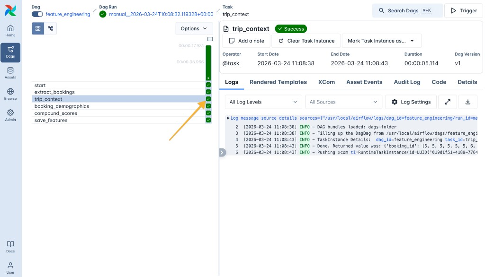

## Exercise 2: Run the classification Dag with enriched features

After completing the feature engineering Dag, you can run the classification Dag to see how the enriched features improve the model.

1. In the Airflow UI, trigger the `space_dessert_classification` Dag.
2. Once it has completed, go to the MLOps plugin and click **Experiments** and then on `dessert_prediction` to see the results of both runs.

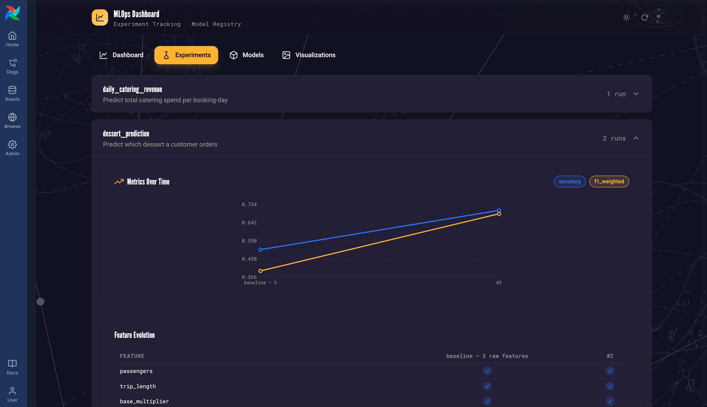

## Challenge: Mission control

It is time for a challenge. The workshop provides a custom `MissionControlOperator` that generates an interstellar clearance code based on your implementation. Only if the Dag has the correct task IDs and dependencies will the code be valid.

Within your `feature_engineering` Dag:

1. Import the `MissionControlOperator` from `include.mission_control`.
2. Create a task instance with `task_id="mission_control"`.
3. Add it as the **last step** in the Dag (downstream of `save_features`).
4. Sync your changes.
5. Run the `setup` Dag to reset the duckdb , the `feature_engineering` Dag should run automatically afterwards based on the asset schedule.
6. Check the `mission_control` task logs for your clearance code and share it!

## Exercise 3: Regression: Hyperparameters and dynamic task mapping

Now that you know how many of each dessert to order (approximately), you also want to try to predict how much revenue you'll be making from the catering alone (food is expensive in space!).

For this you create the `daily_catering_revenue` experiment based on a LinearRegression model to predict the daily revenue from catering per booking party. Looking at the pre-existing run you can see that the R2 score using only the `passengers` (more people eat more food) and `trip_length` (people on longer trips seem to eat a little more food per day) is not very good, it is only `0.43`. That means based on these two features you can predict about 43% of the variance in the daily revenue with a basic linear regression model. We can do better!

1. In the Astro IDE, open `dags/astro_trip_catering_revenue_prediction.py`.

2. Look at the `_MODEL_CONFIG_BASE` variable at the top of the file. It is a dictionary that contains the default configuration for one model (a linear regression). But what if we want to run the `train` task with different model types and hyperparameters? We can do that by using dynamic task mapping.

3. Add the following list of model configurations at the top of the file below the `_MODEL_CONFIG_BASE` variable. This list contains the different model types and hyperparameters we want to try.

```python
_MODEL_CONFIGS = [
    {"model_type": "DecisionTreeRegressor", "max_depth": 2},
    {"model_type": "LinearRegression"},
    {"model_type": "Ridge", "alpha": 10.0},
    {"model_type": "GradientBoostingRegressor", "n_estimators": 200, "max_depth": 10},
]
```

4. Update the call to the `train` task at the bottom of the Dag to use dynamic task mapping and the `_MODEL_CONFIGS` variable. The `payload` argument is the same for all tasks, this is the data fetched from the database in the `extract` task, the different model configurations will be passed to the `train` task as the `config` argument. One dynamically mapped task instance will be created at runtime for each element (dictionary) in the `_MODEL_CONFIGS` list.

```python
_train = train.partial(payload=_extract).expand(config=_MODEL_CONFIGS)
```

5. The next task, the `visualize` task, also needs to be dynamically mapped. In this case over the output of the `train` task. Update the call to the `visualize` task at the bottom of the Dag to use dynamic task mapping.

```python
_visualize = visualize.expand(results=_train)
```

6. Sync your changes and trigger the `astro_trip_catering_revenue_prediction` Dag. You might need to rerun the `setup` Dag (and `feature_engineering` Dag, which runs automatically based on the asset schedule) first to reset the database. In the graph view of the `astro_trip_catering_revenue_prediction` Dag you should now see four parallel `train` tasks and four parallel `visualize` tasks. 

    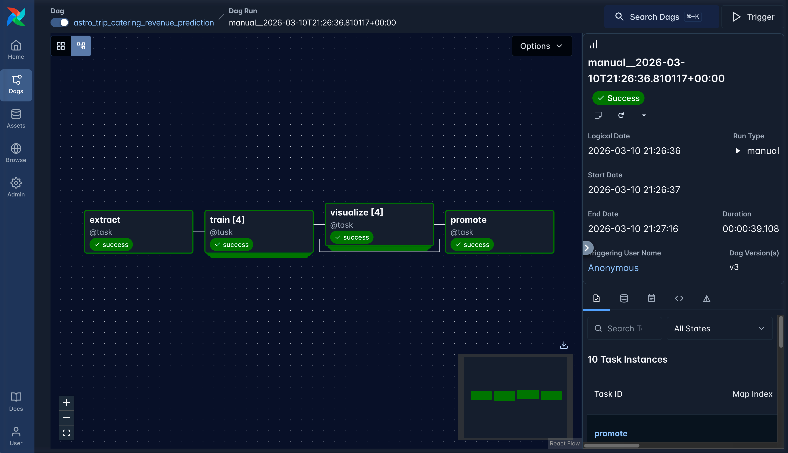

> [!NOTE]
> In this workshop example the `max_active_tasks` Dag parameter is set to 1 to avoid parallel writes to the duckdb database. In production the mapped `train` and visualize tasks would run in parallel.

7. Check out the `daily_catering_revenue` experiment in the MLOps plugin. You should now see 5 runs in total, the base run from earlier and 4 new runs with different model types and hyperparameters.

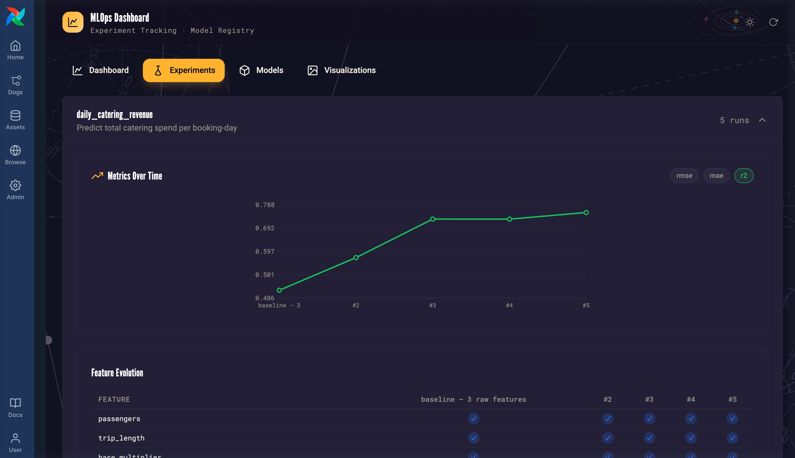

8. Select the base run as well as the _best_ run (the one with the highest R2 score) and click on the **Compare** button to see the direct model comparison.

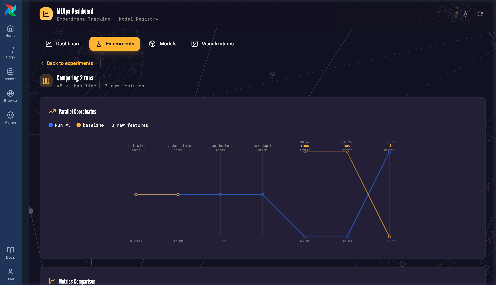

Of course in production you want to always use the best model. This is the purpose of the `promote` task at the end of the model Dags, this task tags the best model as `production` after every Dag run. Check out the `models` tab in the MLOps plugin to see the models and their stages.

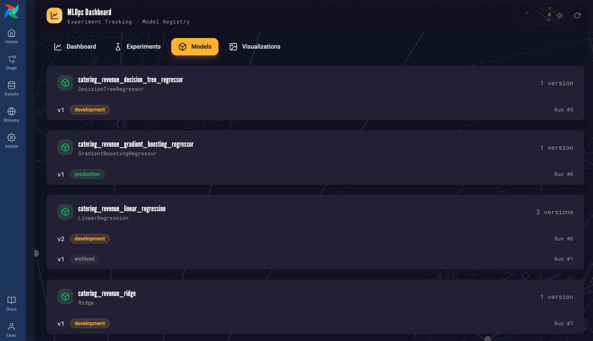

## Exercise 4: Clustering: Food preference segmentation

The third classic ML use case is clustering, finding groups of similar customers. Looking at the baseline run of the `culinary_personas` experiment (Experiments -> culinary_personas -> Run #1), you can see that we tried to find 2 clusters, and got a silouette score of 0.51. 

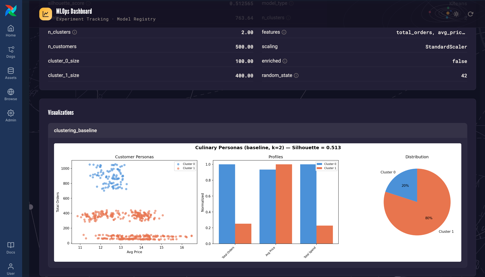

While the scatterplot of course only shows two dimensions, it does suspiciously look like there could be three clusters. Let's try to find out!

1. In the Astro IDE, open `dags/food_preference_clustering.py` and change the `_NUM_CLUSTERS` variable to `3`.

```python
_NUM_CLUSTERS = 3
```

2. Sync your changes and trigger the `food_preference_clustering` Dag again.

3. Check out the `culinary_personas` experiment in the MLOps plugin and see if the silouette score has improved!

---

Congratulations! You've built and improved ML pipelines covering classification, regression, clustering, and feature engineering, all orchestrated by Apache Airflow.

The key takeaways:

- **Better features are key to better results**: Both the classfication and regression models benefited greatly from the enriched features.
- **Dynamic task mapping** lets you run models with different hyperparameters in parallel.
- **Airflow is not just for ETL.** With Airflow you can orchestrate your MLOps end-to end and the 3.1 plugin system let's you track your ML experiments directly in the Airflow UI.

We recommend continuing to extend your project during your Astro trial.